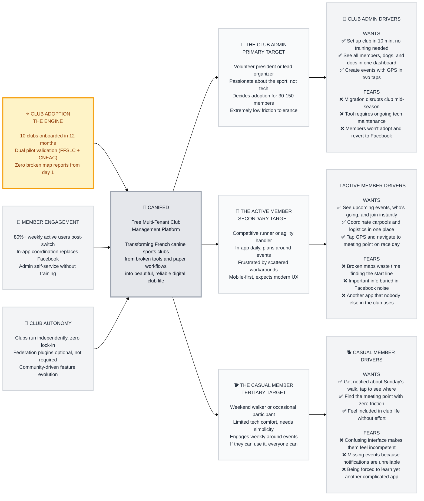

# Trigger Map: CaniFed

> Strategic mapping of business goals to user psychology for CaniFed — the free club management platform for French canine sports clubs

**Document:** Trigger Map - Hub
**Created:** 2026-03-22
**Status:** COMPLETE

---

## How to Read This Map

The Trigger Map flows **left to right**: Business Goals define what success looks like, the Product is the vehicle, Target Groups are the people who make it happen, and Driving Forces reveal the psychology that design must address.

**Priority system:**
- ⭐ PRIMARY = THE ENGINE — everything depends on this
- 🚀 SECONDARY = Driven by the primary goal succeeding
- 🌟 TERTIARY = Real-world benefits that emerge for the community

---

## Visual Trigger Map

---

## The Transformation

**Before CaniFed:** Club admins juggle Excel, Facebook, WhatsApp, paper forms, and broken federation tools. Members coordinate on scattered platforms. GPS doesn't work. Documents get lost. CNEAC clubs have nothing at all.

**After CaniFed:** One beautiful app where club life happens. Events, GPS, chat, members, dogs, documents — all in one place. Admins create events in seconds. Members see what's happening and show up. It just works.

---

## The Flywheel: Club Adoption Drives Everything

**⭐ THE ENGINE (Priority #1):**
- 10 clubs onboarded in 12 months
- One admin decides, 30-150 members follow
- Each successful club becomes a reference for neighboring clubs
- Peer recommendation is the primary adoption channel

**🚀 MEMBER ENGAGEMENT (Priority #2):**
- Driven BY successful club adoption
- 80%+ weekly active users means the club actually switched
- In-app coordination replaces Facebook/WhatsApp workarounds
- Members love the daily experience = admins stay

**🌟 CLUB AUTONOMY (Priority #3):**
- Real-world benefit FOR the community
- No vendor lock-in, no federation dependency
- Clubs own their digital space
- Opens path to community-driven feature evolution

---

## Business Strategy

**Key Strategic Insight:** Acquisition is B2B (convince one admin), retention is B2C (members must love it). The admin is the gatekeeper and the most critical persona — if they can't set up the club in 10 minutes without training, adoption fails.

**Two Acquisition Paths:**
1. **FFSLC clubs:** "Replace your broken tool" — pain-driven migration from CaniClub Connect
2. **CNEAC clubs:** "Get your first digital tool" — greenfield adoption from paper/nothing

**Adoption Psychology:** Free removes the decision barrier, but the tool must solve a felt pain on day one. 84% of sports associations are not digitally experienced. Peer recommendation between clubs is the growth engine.

---

## Personas Overview

### 🎯 Perrine l'Organisatrice — The Club Admin (PRIMARY)

Volunteer admin who runs events, manages members, and keeps the club alive digitally. She's passionate about her sport, competent in her domain, but frustrated by terrible tools. She doesn't want to learn tech — she wants tech that works. Her decision to adopt CaniFed brings 30-150 members along.

**Top Drivers:**
- ✅ Set up club in 10 min, see everything in one dashboard, create events with GPS in two taps
- ❌ Migration disrupts club, tool requires maintenance, members won't adopt

→ [Full persona: personas/perrine-admin.md](personas/perrine-admin.md)

### 🏃 Julie la Compétitrice — The Active Member (SECONDARY)

Daily user who plans her season around events. Coordinates carpools, checks who's going, needs working GPS on race day. Currently scattered across Facebook, WhatsApp, and CaniClub Connect. She'll be CaniFed's power user and champion — if it works.

**Top Drivers:**
- ✅ See events and join instantly, coordinate in one place, tap GPS and go
- ❌ Broken maps, info buried in Facebook, app nobody uses

→ [Full persona: personas/julie-active.md](personas/julie-active.md)

### 🐕 Patrick le Randonneur — The Casual Member (TERTIARY)

Weekly walker who needs things to be obvious. Picks walks from the calendar, needs the meeting point clear, taps for directions. If Patrick can use it without help, the design is right. He's the litmus test for simplicity.

**Top Drivers:**
- ✅ Get notified, see the meeting point, feel included
- ❌ Confusing interface, unreliable notifications, complicated app

→ [Full persona: personas/patrick-casual.md](personas/patrick-casual.md)

---

## Strategic Implications

### 1. Admin Experience Is the Gate
Everything depends on the club admin's first 10 minutes. If onboarding fails, the club never adopts, and 30-150 members never see CaniFed.

### 2. GPS Must Be Flawless
Broken maps are CaniClub Connect's biggest failure. Working GPS is table stakes — it's the #1 pain point for both admins and members.

### 3. Mobile-First, Obvious-First
Tech comfort ranges from Julie (power user) to Patrick (barely digital). Design for Patrick; Julie will fly.

### 4. Event-Centric Architecture
Members engage through events. The event is the core interaction surface: upcoming events, who's going, meeting point, directions.

### 5. Don't Compete on Payments or Accounting
Integrate with HelloAsso for payments. Focus on what no one else offers: canine-specific club management.

---

## Related Documents

- **[personas/perrine-admin.md](personas/perrine-admin.md)** — Primary persona: The Club Admin
- **[personas/julie-active.md](personas/julie-active.md)** — Secondary persona: The Active Member
- **[personas/patrick-casual.md](personas/patrick-casual.md)** — Tertiary persona: The Casual Member
- **[feature-impact-analysis.md](feature-impact-analysis.md)** — Driving forces prioritization

---

_Trigger Map for CaniFed — connecting business goals to user psychology._
