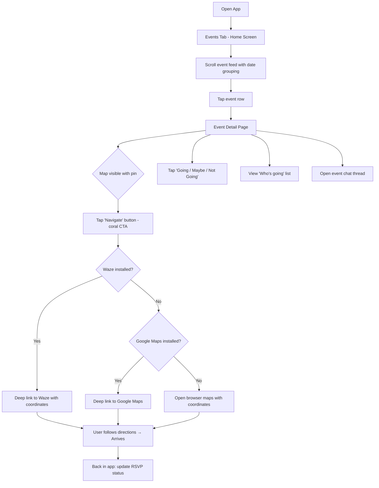
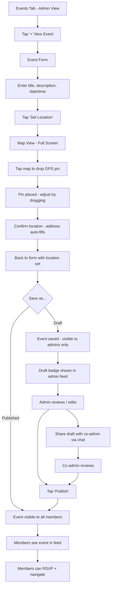
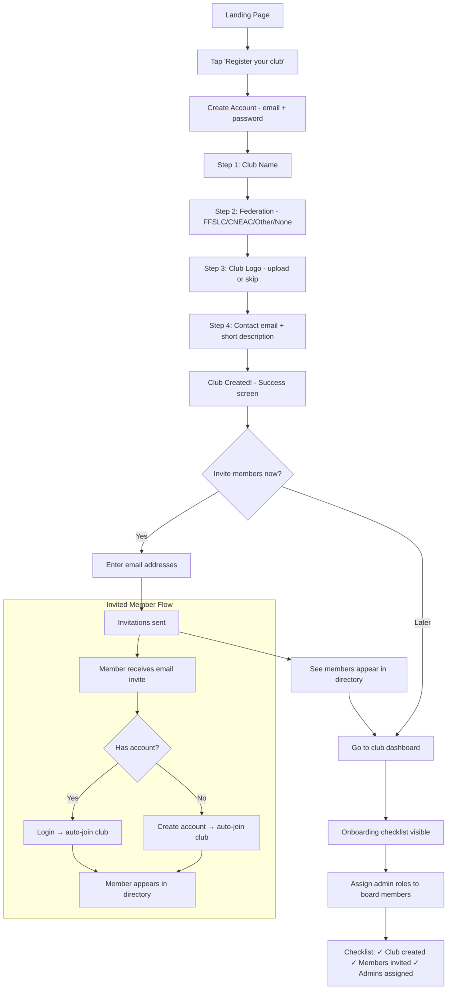
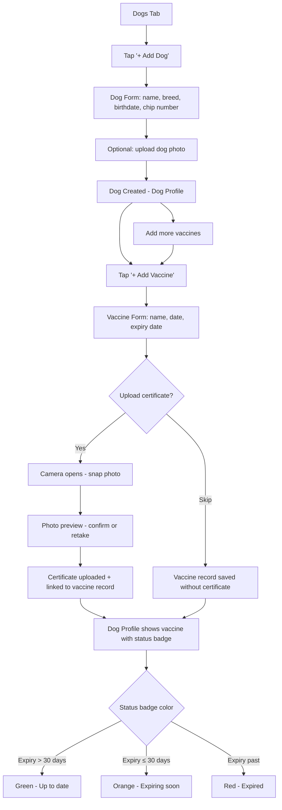
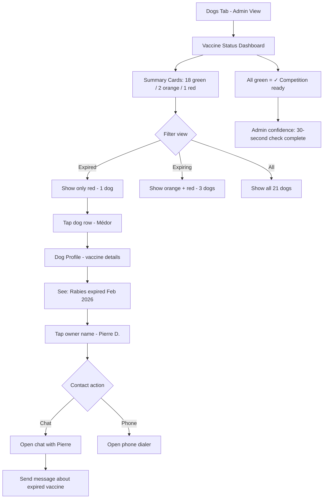
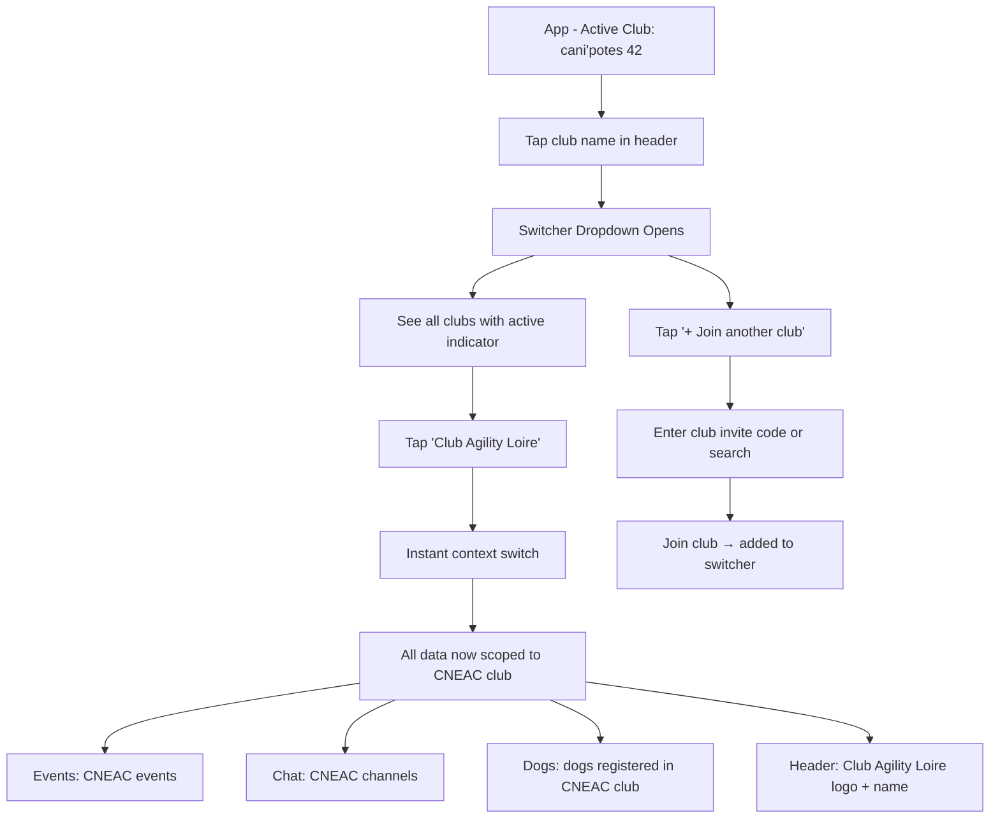

# UX Design Specification CaniFed

**Author:** Leader
**Date:** 2026-03-21

---

<!-- UX design content will be appended sequentially through collaborative workflow steps -->

## Executive Summary

### Project Vision

CaniFed is a free, multi-tenant PWA for French canine sports clubs that replaces CaniClub Connect's broken experience for FFSLC clubs and provides the first-ever digital tool for CNEAC clubs running entirely on paper. The UX must deliver on a simple promise: it just works — maps that navigate in one tap, chat that's reliable, events that admins can draft before publishing, and document management that replaces paper binders. Built mobile-first with React + Tailwind + shadcn/ui, the platform serves users ranging from tech-savvy competitors to non-technical club secretaries.

### Target Users

| Persona | Role | Tech Comfort | Primary Need | Device |
|---|---|---|---|---|
| Julie, 32 | Competitor (member) | High | Events + maps + chat + "who's going" | Phone |
| Patrick, 55 | Casual walker (member) | Low | Simple event view + one-tap navigation | Phone |
| Perrine | Event organizer (admin) | Moderate | Draft/publish events + GPS pin placement | Phone/Tablet |
| Marie, 45 | CNEAC club president (admin) | Moderate | Document digitization + vaccine tracking + payments | Tablet/Desktop |
| Aude | Club secretary (admin) | Very low | Guided club setup + member management | Phone/Laptop |
| Multi-club member | Member | Varies | Seamless club switching, single login | Phone |

### Key Design Challenges (ordered by impact)

1. **Map + navigation is the table stakes trust test** — GPS pin placement (admin) must be precise in 2 taps. Navigation redirect to Waze/Google Maps (members) must work in one tap, every time. This is the #1 pain point from CaniClub Connect and the FFSLC "hero interaction" — the moment a member taps Navigate and arrives at the right spot, they trust the entire platform. Zero tolerance for failure.

2. **CNEAC document flows are the real differentiator** — This isn't replacing a bad tool — it's category creation. CNEAC clubs have zero digital tools. Document upload, vaccine tracking with green/orange/red status indicators, and the admin vaccine dashboard are the CNEAC "hero interaction" — Marie checking 20 dogs in 30 seconds instead of flipping through a paper binder. This is where the platform wins or loses the CNEAC market.

3. **Multi-tenant complexity hidden behind simplicity** — Club switching, role-based access (Owner/Admin/Member), and tenant-scoped data must feel effortless. The club switcher is the one place where tenancy is visible — it needs to feel like switching between WhatsApp groups or Slack workspaces: instant, intuitive, zero cognitive load. Deserves its own UX pattern.

4. **Wide tech-comfort spectrum requires adaptive complexity** — Not just progressive disclosure (showing/hiding features by role) but actual flow simplification for low-tech personas. Patrick and Aude need bigger touch targets, fewer steps, simplified navigation. Julie and Perrine need efficiency and power. The interface must serve both without feeling dumbed-down or overwhelming.

5. **Onboarding is the critical path dependency** — Aude's club setup journey is the most fragile point in the entire adoption funnel. If she can't create and configure the club in 10 minutes, Marie never gets her vaccine dashboard, Patrick never gets his one-tap navigation, and the club never adopts. Everything flows from successful onboarding.

### Design Opportunities

1. **Two hero interactions, two markets** — FFSLC: map→navigate in one tap (trust moment). CNEAC: vaccine dashboard check in 30 seconds (value moment). Each market has a single make-or-break interaction that defines platform credibility. Design around these moments first.

2. **Adaptive complexity architecture** — Role-based feature visibility combined with flow simplification for low-tech users. Members see events + chat + their dogs. Admins see management tools. Owners see settings. Low-tech users get simplified flows with fewer steps and larger targets. Power users get efficiency shortcuts.

3. **Onboarding as competitive moat** — Guided club registration (Aude's journey) and email-based member invitation set the tone. The first 10 minutes must be delightful and foolproof. If onboarding succeeds, adoption follows organically through word-of-mouth.

4. **Club switcher as UX benchmark moment** — Reference WhatsApp/Slack context-switching patterns. Instant, intuitive, no cognitive load. This is where multi-tenancy becomes a feature, not a burden.

## Core User Experience

### Defining Experience

CaniFed's core experience is built around two primary interaction loops:

1. **The Event Loop (all clubs):** See event → check location → tap Navigate → arrive at the right place. This is the most frequent daily interaction for both FFSLC and CNEAC club members. It is the single interaction that defines the product's value — the one CaniClub Connect breaks daily.

2. **The Document Loop (CNEAC clubs):** Upload document → track vaccine/license status → verify at competition. This is the category-creating interaction that serves a completely unserved market.

The defining user action is: **event → navigate → arrive**. If this works perfectly every time, users trust the platform. Everything else builds on that trust.

### Platform Strategy

| Dimension | Decision | Rationale |
|---|---|---|
| **Platform** | Progressive Web App (PWA) | No app store dependency, instant updates, single codebase |
| **Primary interaction** | Touch-based (mobile) | Members check events and navigate on phones |
| **Secondary interaction** | Mouse/keyboard (desktop) | Admins manage members, documents, payments on larger screens |
| **Responsive breakpoints** | Tailwind defaults (sm: 640px, md: 768px, lg: 1024px, xl: 1280px) | Industry standard, well-supported |
| **Offline** | Not required (MVP) | Events and chat require connectivity; defer offline to post-MVP |
| **Device capabilities** | Camera (document upload), GPS (navigation redirect), notifications (post-MVP) | Camera for vaccine certificate photos; GPS for Waze/Google Maps handoff |
| **Browser support** | Modern only — Chrome, Firefox, Safari, Edge (last 2 versions) | PWA requires modern browser features |

### Effortless Interactions

These interactions must feel completely natural and require zero thought:

| Interaction | Target Experience | Current Pain (CaniClub) |
|---|---|---|
| **One-tap navigation** | Event → tap Navigate → Waze/Google Maps opens with correct coordinates | Broken maps, manual coordinate sharing via WhatsApp |
| **Two-tap GPS pin** | Admin taps map location → pin placed → coordinates saved | Slow, imprecise pin placement, wrong coordinates |
| **Club switching** | Tap club name → instant context change → all data scoped | N/A (single-club only) |
| **Document upload** | Phone camera → photo → auto-associated to dog/member | Paper binders, photocopies |
| **Draft → Publish** | Toggle visibility → members see finalized event | No draft state, members see incomplete events immediately |
| **Vaccine status check** | Open dashboard → green/orange/red at a glance → 30 seconds for 20 dogs | Paper binder, phone calls, 15 minutes for 3 dogs |

### Critical Success Moments

| Moment | Persona | What Happens | Why It Matters |
|---|---|---|---|
| **"It actually works"** | Julie, Patrick | First time tapping Navigate and arriving at the right spot via Waze | Proves the platform solves the #1 FFSLC pain point. Trust is established. |
| **"No more paper"** | Marie | First competition-day vaccine check via dashboard in 30 seconds | Proves digital document management replaces paper. CNEAC value validated. |
| **"I set this up myself"** | Aude | Club created, 3 members invited, all in 10 minutes | Proves the platform is accessible to non-technical users. Adoption unlocked. |
| **"Everyone's here"** | Perrine | First event created with draft → publish, GPS pin, full RSVP list | Proves admin workflow is frictionless. All 10 admins adopt naturally. |
| **"One app, both clubs"** | Multi-club member | Switches between FFSLC and CNEAC clubs seamlessly | Proves multi-tenancy works invisibly. Organic growth enabled. |

### Experience Principles

1. **One tap to value** — Every primary action is reachable in one tap from context. Navigate from event. Upload from dog profile. Publish from draft. Eliminate intermediate screens that add friction without adding clarity.

2. **Trust through reliability** — Features don't need to be innovative. They need to work, every time, without exception. Maps, chat, uploads — boring reliability beats flashy features. The bar set by CaniClub Connect is low; clearing it with consistency creates instant loyalty.

3. **Adaptive simplicity** — The interface adapts to the user, not the other way around. Low-tech users (Patrick, Aude) get simplified flows with bigger targets and fewer steps. Power users (Julie, Perrine) get efficiency shortcuts. Same platform, different cognitive loads.

4. **Mobile-first, admin-scalable** — Design for the phone in the member's hand first. Scale up to tablet/desktop for admin dashboards and bulk operations. Never design desktop-down.

5. **Invisible tenancy** — Multi-club architecture is completely invisible except the club switcher. No "tenant" language, no "organization" jargon. Just "my clubs." Data isolation is a technical guarantee, not a user-facing concept.

## Desired Emotional Response

### Primary Emotional Goals

The dominant emotional thread for CaniFed is **relief and trust**, not excitement or novelty. These users have been burned by broken tools (FFSLC) or burdened by paper processes (CNEAC). The emotional win is: *"This works. I can rely on it."*

| Emotional Goal | Persona Context | What Triggers It |
|---|---|---|
| **Relief** | Julie, Patrick (FFSLC) | Map works, navigation opens correctly, no workarounds needed |
| **Empowerment** | Aude, Marie (non-tech admins) | Successfully completing a task they expected to struggle with |
| **Calm confidence** | Perrine (organizer) | Draft/publish workflow, no premature visibility, professional control |
| **Liberation** | Marie (CNEAC) | Digital dashboard replaces paper binder — tedium eliminated |
| **Belonging** | All members | Seeing "who's going," chat activity, club community in one place |

### Emotional Journey Mapping

| Stage | Desired Emotion | Design Implication |
|---|---|---|
| **Discovery** | Curiosity + low anxiety | Clean landing page, no feature overload, clear value proposition in one sentence |
| **Onboarding** | Confidence + empowerment | Guided step-by-step flow, immediate small wins (club created, first member invited), progress indicators |
| **First core action** | Relief + pleasant surprise | "It actually worked" — maps navigate correctly, chat messages appear instantly, GPS pin lands precisely |
| **Daily use** | Calm efficiency | Zero friction, predictable patterns, everything where expected, no cognitive overhead |
| **Error/failure** | Supported, not abandoned | Clear error messages in plain language, obvious recovery paths, no dead ends, no blame |
| **Returning** | Familiarity + belonging | Personalized context (active club, recent events), club community warmth, recognition of membership |

### Micro-Emotions

These subtle emotional states drive satisfaction and retention:

| Micro-Emotion Pair | Priority Persona(s) | Design Strategy |
|---|---|---|
| **Confidence over confusion** | Patrick, Aude | Every tap feels safe. Clear labels, obvious actions, no ambiguous icons. Undo where possible. |
| **Trust over skepticism** | Julie, all FFSLC migrants | Reliability is the design language. Consistent behavior, no surprises, maps that always work. First impression must contradict CaniClub memories. |
| **Belonging over isolation** | All members | "Who's going" lists, chat presence, participation counts, club identity (logo, name) visible throughout. The app feels like the club, not a tool. |
| **Accomplishment over frustration** | Marie, Perrine | Task completion is celebrated subtly — green checkmarks, status updates, progress indicators. Admin work feels productive, not bureaucratic. |
| **Pride over embarrassment** | Patrick, Aude | Non-tech users should feel capable, never stupid. No error messages that imply user fault. Guided flows that make success inevitable. |

### Emotions to Avoid

| Negative Emotion | Risk Context | Prevention Strategy |
|---|---|---|
| **Anxiety** | Complex forms, too many options, unfamiliar interfaces | Progressive disclosure, minimal required fields, sensible defaults, one primary action per screen |
| **Embarrassment** | Tech struggles visible to others, asking for help | Private error handling, no public failure states, self-service recovery |
| **Distrust** | Anything reminiscent of CaniClub's failures | Maps must work first try. Chat must deliver. No "try again later" for core features. |
| **Overwhelm** | Feature-rich admin dashboards, 30 events/month feed | Smart filtering, role-based views, information hierarchy, "show me what matters" defaults |
| **Abandonment** | Errors without guidance, dead-end screens | Every error has a next step. Every screen has an escape. Help is contextual, not buried. |

### Emotional Design Principles

1. **Reliability is the emotion** — In a market where the incumbent is broken, consistent, predictable behavior IS the emotional differentiator. Every interaction that works as expected builds trust. No feature gimmicks, no surprise animations — just things working.

2. **Celebrate quiet wins** — Small, subtle positive feedback (green status indicator, checkmark on task complete, participant count going up) creates a sense of accomplishment without being patronizing. Marie's vaccine dashboard going all-green should feel like a win.

3. **Never blame the user** — Error messages use "we" language ("We couldn't upload that file — try a smaller image") not "you" language. Patrick and Aude should never feel that technology failed because of them.

4. **Club warmth over tool coldness** — The app should feel like the club's digital home, not a management tool. Club logo visible, member names (not IDs), photos in chat, "who's going" with real names. Community, not software.

5. **Confidence through progressive reveal** — Show only what each user needs at each moment. Confidence comes from understanding what's on screen. Overwhelm is the enemy of trust. When in doubt, hide it until they need it.

## UX Pattern Analysis & Inspiration

### Inspiring Products Analysis

#### Waze — "Tap and go" navigation
| Aspect | Analysis | Relevance to CaniFed |
|---|---|---|
| **Core UX** | Zero-friction destination launch. Tap → navigate → arrive. No intermediate screens. | Direct model for event→navigate hero interaction |
| **Onboarding** | Minimal setup — location permission, then immediate value. No walls of forms. | Model for member onboarding — get to value fast |
| **Reliability** | Users trust it because it works consistently. No "try again" moments. | The emotional goal: trust through reliability |
| **Community layer** | Community-sourced reports and alerts create belonging without demanding effort | Inspiration for lightweight social features (participation counts, "who's going") |
| **Error handling** | Reroutes silently, never blames the user | Model for graceful error recovery |

#### Strava — Sports community that blends utility and belonging
| Aspect | Analysis | Relevance to CaniFed |
|---|---|---|
| **Activity feed** | Card-based feed mixing personal data with social context. Clean, scannable. | Model for event feed — card-based, filterable, social signals |
| **Club features** | Clubs with members, leaderboards, group challenges. Community identity. | Direct model for club-scoped features and community warmth |
| **Social engagement** | Kudos (one-tap acknowledgment), comments, sharing. Low-effort interaction. | Inspiration for RSVP interaction (going/maybe) — lightweight, one-tap |
| **Mobile-first** | Designed phone-first, scales to web for deeper analysis | Validates our mobile-first, admin-scalable strategy |
| **Segment/achievement** | Personal progress visible in social context | Model for vaccine status dashboard (personal + admin overview) |

#### WhatsApp — Messaging that everyone understands
| Aspect | Analysis | Relevance to CaniFed |
|---|---|---|
| **Universal familiarity** | Message bubbles, groups, media sharing — patterns understood by all ages | Chat UI must follow these established conventions, not reinvent |
| **Group switching** | Tap group → instant context. List of groups is clear and navigable. | Direct model for club switcher — same mental model |
| **Media sharing** | Image sharing is seamless — camera → send. No complex upload flow. | Model for chat image sharing and document photo upload |
| **Bottom navigation** | Tab bar for primary navigation — chats, status, calls. Always accessible. | Model for app navigation structure |
| **Low cognitive load** | Even non-tech users (Patrick's generation) use it daily without support | The accessibility benchmark — if Patrick uses WhatsApp, our app must be equally intuitive |

### Transferable UX Patterns

**Navigation Patterns:**
- **Bottom tab bar** (WhatsApp) — Primary navigation for mobile. Events, Chat, My Dogs, Profile. Always accessible, one tap to any section.
- **Card-based feed** (Strava) — Event feed as scrollable cards with key info visible: title, date, location preview, participant count, RSVP status.
- **Context switching** (WhatsApp groups) — Club switcher follows the same mental model. Tap club name → instant context change → all content scoped.

**Interaction Patterns:**
- **One-tap navigation launch** (Waze) — Event detail → Navigate button → Waze/Google Maps opens with coordinates. Zero intermediate screens.
- **Lightweight social signals** (Strava kudos) — RSVP as going/maybe/not going in one tap. Participation count visible on event cards. "Who's going" expandable list.
- **Camera-first media** (WhatsApp) — Document upload starts with camera option prominent. Snap vaccine certificate → auto-upload. File picker as secondary option.

**Visual Patterns:**
- **Status indicators** (Strava achievements) → Green/orange/red vaccine status badges. Instant visual scanning.
- **Clean card hierarchy** (Strava feed) → Event cards with clear information hierarchy: title > date/time > location > social signals.
- **Familiar chat bubbles** (WhatsApp) → Chat UI follows established conventions. No custom messaging patterns.

### Anti-Patterns to Avoid

| Anti-Pattern | Source | Why to Avoid |
|---|---|---|
| **Broken map with no navigation handoff** | CaniClub Connect | The #1 pain point. Our maps MUST open in Waze/Google Maps reliably. |
| **Invisible text while typing** | CaniClub Connect | Chat input must show typed text clearly. Basic, but the incumbent fails here. |
| **Instant publish with no draft** | CaniClub Connect | Events must support draft → publish flow. Never expose incomplete events to members. |
| **Cluttered unfiltered feeds** | CaniClub Connect | 30 events/month needs smart filtering. Don't dump everything in a single chronological list. |
| **Complex onboarding forms** | Generic SaaS | Don't ask for everything upfront. Minimal fields to start, progressive profile completion. |
| **Desktop-first responsive** | Generic web apps | Design mobile-first. Scaling down from desktop always feels cramped on phones. |
| **Custom messaging UI** | Various apps | Don't reinvent chat. Use WhatsApp-familiar patterns. Users shouldn't learn a new messaging paradigm. |

### Design Inspiration Strategy

**Adopt directly:**
- WhatsApp bottom tab navigation pattern
- WhatsApp group-switching mental model for club switcher
- WhatsApp chat bubble conventions for messaging
- Waze one-tap navigation launch pattern
- Strava card-based activity/event feed layout

**Adapt for our context:**
- Strava club features → adapt for canine sports club structure (events, members, dogs instead of activities, segments, challenges)
- Strava social signals (kudos) → simplify to RSVP (going/maybe/not going) with participant counts
- WhatsApp media sharing → extend to document upload with camera-first flow and auto-association to dogs

**Avoid deliberately:**
- Every CaniClub Connect pattern — broken maps, invisible typing, no drafts, cluttered feeds
- Complex SaaS onboarding — no multi-step wizards, no required fields beyond the minimum
- Desktop-first design — never scale down, always scale up
- Custom UI paradigms — stick to patterns users already know from Waze, Strava, WhatsApp

## Design System Foundation

### Design System Choice

**Selected: shadcn/ui + Tailwind CSS + Radix UI primitives**

This is a themeable component system — pre-built, accessible components that you own and customize. Not a rigid framework, not a full custom system. The sweet spot for a solo developer shipping fast with full control.

### Rationale for Selection

| Factor | Decision Driver |
|---|---|
| **Already in stack** | Tailwind CSS and shadcn/ui are specified in the PRD and initialized in the Nx monorepo |
| **Accessibility built-in** | Radix UI primitives provide WCAG 2.1 AA compliant keyboard navigation, focus management, and ARIA labels out of the box — directly addresses NFR18-22 |
| **Solo dev speed** | Copy-paste component model means no library lock-in. Components are yours to modify without fighting an API. |
| **Customization depth** | CSS variable theming allows per-club branding (future freemium feature) without component rewrites |
| **Form ecosystem** | Native integration with React Hook Form + Zod for shared frontend/backend validation schemas |
| **Community** | Large, active community with extensive component examples and patterns |
| **Performance** | Tailwind purges unused CSS. No CSS-in-JS runtime. Minimal bundle impact. |

### Implementation Approach

**Component Categories:**

| Category | Source | Examples |
|---|---|---|
| **Base components** | shadcn/ui (direct use) | Button, Card, Dialog, Input, Select, Tabs, Badge, Avatar, Tooltip |
| **Form components** | shadcn/ui + React Hook Form + Zod | Form fields, validation, error display, multi-step forms |
| **Layout components** | Custom (Tailwind) | Bottom tab bar, mobile shell, admin sidebar, responsive grid |
| **Domain components** | Custom (built on shadcn primitives) | Event card, map widget, club switcher, vaccine status badge, RSVP button, chat bubble |
| **Data display** | shadcn/ui + custom | Member directory table, document list, payment history, admin dashboard |

**Shared Nx Library:**
- Design tokens (colors, spacing, typography) as CSS variables in a shared `ui` library
- Reusable domain components exported from the shared library
- Tailwind config shared across the monorepo

### Customization Strategy

**Theme Tokens (CSS Variables):**
- Primary color palette — club-agnostic defaults, with future per-club theming capability
- Semantic colors — success (green), warning (orange), danger (red) for vaccine status and alerts
- Spacing scale — following Tailwind defaults (4px base unit)
- Typography scale — Inter or system font stack for readability across all ages
- Border radius — consistent rounding (shadcn defaults: rounded-md for most elements)

**Custom Components to Build:**
1. **MapWidget** — Leaflet/react-leaflet integration with GPS pin placement (admin) and one-tap navigation (member)
2. **ClubSwitcher** — WhatsApp-style context switcher in header/sidebar
3. **EventCard** — Strava-inspired card with title, date, location preview, participant count, RSVP
4. **VaccineStatusBadge** — Green/orange/red indicator with semantic meaning
5. **RSVPButton** — One-tap going/maybe/not going with count display
6. **ChatBubble** — WhatsApp-familiar message display with image support
7. **BottomTabBar** — Mobile primary navigation (Events, Chat, Dogs, Profile)
8. **OnboardingFlow** — Guided step-by-step club/member setup

**What We Don't Customize:**
- Standard form inputs — use shadcn defaults
- Dialogs and modals — use shadcn defaults
- Dropdowns and selects — use shadcn defaults
- Tooltips and popovers — use shadcn defaults
- The goal: customize only where domain-specific interaction patterns require it

## Defining Core Experience

### Defining Experience

CaniFed has two defining experiences — one per market:

**FFSLC: "Tap → Navigate → Arrive"**
The member opens the app, sees Sunday's canirando, taps Navigate, Waze opens with the right coordinates, they arrive. Three taps from app launch to driving directions. This is what they'll tell other club members: "The map actually works."

**CNEAC: "Open → All Green → Ready"**
The admin opens the vaccine dashboard before competition, sees green/orange/red status for every dog. All green — competition ready in 30 seconds. This is what Marie tells the neighboring club president: "No more paper binder."

Both experiences share the same principle: **the product's magic is the absence of friction**. Not a flashy feature — the removal of pain.

### User Mental Model

**FFSLC members' mental model:**
- They currently open CaniClub Connect → fight the map → screenshot the address → open Google Maps separately → type it in → hope it's right
- Their expectation: "Show me where to go and get me there." Like Waze — I tap, it navigates
- Confusion risk: If the map requires zoom/scroll to find the pin, or if the Navigate button isn't immediately visible
- Workaround they use today: Screenshot GPS coordinates, share in WhatsApp group, open separately in Google Maps

**CNEAC admins' mental model:**
- They currently flip through a paper binder → find each dog's page → check vaccine dates → call owners for missing records
- Their expectation: "Show me who's ready and who's not." Like a to-do list — green means done
- Confusion risk: If vaccine status is buried in dog profile details instead of surfaced in a dashboard view
- Workaround they use today: Paper binder, phone calls, manual spreadsheet tracking

**Shared mental model:**
- Club members think in terms of "my club" and "my events," not "tenants" and "organizations"
- They expect WhatsApp-level simplicity: open → see what's relevant → act
- Multi-club members think of clubs like WhatsApp groups: tap to switch context

### Success Criteria

**"Tap → Navigate → Arrive" success criteria:**

| Criteria | Metric | Why It Matters |
|---|---|---|
| Navigate button visible without scrolling | Above the fold on event detail page | Patrick won't scroll to find it |
| One tap opens Waze/Google Maps | Zero intermediate screens, no "choose app" dialog on repeat use | Julie expects Waze-level speed |
| Coordinates are always correct | 100% accuracy — no wrong locations | CaniClub's #1 failure. One wrong coordinate = broken trust |
| Works on first use | No setup, no permissions (beyond location), no account linking | Aude's first impression determines adoption |

**"Open → All Green → Ready" success criteria:**

| Criteria | Metric | Why It Matters |
|---|---|---|
| Dashboard loads in <1 second | Instant visual scan | Marie checks this under time pressure before competitions |
| Status is color-coded | Green/orange/red visible at a glance, no reading required | Speed of comprehension — 20 dogs in 30 seconds |
| Expired vaccines are unmissable | Red status + sorted to top or filtered | Safety-critical — expired vaccine = dog can't compete |
| Drill-down to details in one tap | Status badge → dog profile → vaccine details | Admin needs to contact the owner with specific info |

### Novel UX Patterns

**Pattern approach: Established patterns, domain-specific combinations.**

CaniFed does NOT need novel UX patterns. The competitive advantage is **reliable execution of proven patterns** in a domain that has never seen them properly implemented.

| Pattern | Source | Our Application | Novel? |
|---|---|---|---|
| One-tap navigation | Waze | Event → Waze/Google Maps redirect | No — direct adoption |
| Card-based feed | Strava | Event feed with social signals | No — direct adoption |
| Status badges | Dashboard UIs | Vaccine green/orange/red | No — standard pattern |
| Bottom tab bar | WhatsApp, iOS | Primary mobile navigation | No — direct adoption |
| Context switcher | WhatsApp groups, Slack | Club switcher | No — direct adoption |
| Draft → Publish | CMS systems | Event visibility toggle | No — standard pattern |
| Camera-first upload | WhatsApp | Document/vaccine certificate upload | No — adapted |
| RSVP buttons | Meetup, Facebook Events | Going/Maybe/Not Going | No — direct adoption |

**The only potentially novel combination:** Merging Waze-style navigation with Strava-style club community in a Meetup-style event structure — but each individual pattern is established. Users won't need to learn anything new.

### Experience Mechanics

#### Mechanic 1: "Tap → Navigate → Arrive"

**1. Initiation:**
- User opens app → lands on event feed (home screen)
- Upcoming events sorted by date, next event prominent
- Event card shows: title, date/time, location name, participant count, map thumbnail

**2. Interaction:**
- User taps event card → event detail page
- Map widget shows GPS pin with location name
- Large, prominent "Navigate" button below map (above the fold on mobile)
- Button shows Waze/Google Maps icon based on user's installed apps

**3. Feedback:**
- Tapping Navigate → immediate deep link to Waze or Google Maps
- Coordinates pre-loaded — user sees route immediately
- No loading spinner, no intermediate screen
- If neither Waze nor Google Maps installed → fallback to browser maps with coordinates

**4. Completion:**
- User arrives at location — success is physical (they're there)
- Back in app: participation status can be updated
- Event chat available for last-minute coordination

#### Mechanic 2: "Open → All Green → Ready"

**1. Initiation:**
- Admin navigates to Dogs/Health section (bottom tab or admin menu)
- Dashboard shows all club dogs with vaccine status summary
- Filter by: all, expiring soon, expired

**2. Interaction:**
- Color-coded list: green (up to date), orange (expiring within 30 days), red (expired)
- Each row: dog name, owner name, status badge, expiry date
- Tap row → dog profile with vaccine details

**3. Feedback:**
- All green = visual relief, no action needed
- Orange/red = clear call to action (contact owner, request updated certificate)
- Count badges: "18 up to date, 2 expiring, 1 expired"

**4. Completion:**
- Admin has verified all dogs for competition — dashboard is the proof
- Can filter by specific event participants (post-MVP enhancement)
- Export/print option for federation compliance (post-MVP)

## Visual Design Foundation

### Color System

**Primary Palette: Blue + Coral**

| Token | Role | Hex | Usage |
|---|---|---|---|
| `--primary` | Trust blue | `#2563EB` (blue-600) | Primary buttons, active nav, links, headers |
| `--primary-hover` | Darker blue | `#1D4ED8` (blue-700) | Button hover states |
| `--primary-light` | Soft blue | `#DBEAFE` (blue-100) | Selected states, backgrounds, badges |
| `--primary-foreground` | White on blue | `#FFFFFF` | Text on primary backgrounds |
| `--accent` | Warm coral | `#F97316` (orange-500) | CTAs, highlights, Navigate button, RSVP active |
| `--accent-hover` | Deeper coral | `#EA580C` (orange-600) | Accent hover states |
| `--accent-light` | Soft coral | `#FFF7ED` (orange-50) | Accent backgrounds, notification badges |

**Semantic Colors (non-negotiable for vaccine dashboard):**

| Token | Role | Hex | Usage |
|---|---|---|---|
| `--success` | Green | `#16A34A` (green-600) | Vaccine up to date, payment complete, published events |
| `--success-light` | Soft green | `#DCFCE7` (green-100) | Success backgrounds |
| `--warning` | Orange | `#D97706` (amber-600) | Vaccine expiring, pending actions |
| `--warning-light` | Soft amber | `#FEF3C7` (amber-100) | Warning backgrounds |
| `--danger` | Red | `#DC2626` (red-600) | Vaccine expired, errors, destructive actions |
| `--danger-light` | Soft red | `#FEE2E2` (red-100) | Error backgrounds |

**Neutral Palette (warm grays for club warmth):**

| Token | Role | Hex | Usage |
|---|---|---|---|
| `--background` | Page background | `#FAFAFA` (zinc-50) | Main background — slightly warm |
| `--card` | Card background | `#FFFFFF` | Event cards, content containers |
| `--muted` | Muted text | `#71717A` (zinc-500) | Secondary text, timestamps, metadata |
| `--muted-foreground` | Subtle text | `#A1A1AA` (zinc-400) | Placeholder text, disabled states |
| `--border` | Borders | `#E4E4E7` (zinc-200) | Card borders, dividers |
| `--foreground` | Primary text | `#18181B` (zinc-900) | Body text, headings |

**Accessibility:** All color combinations meet WCAG 2.1 AA minimum contrast ratios (4.5:1 for normal text, 3:1 for large text). Semantic colors are never used as the sole differentiator — always paired with text labels or icons.

### Typography System

**Font Stack: Inter (with system fallback)**

| Level | Size | Weight | Line Height | Usage |
|---|---|---|---|---|
| **H1** | 24px / 1.5rem | 700 (Bold) | 1.2 | Page titles (Events, Members, Dogs) |
| **H2** | 20px / 1.25rem | 600 (Semibold) | 1.3 | Section headers, event titles |
| **H3** | 16px / 1rem | 600 (Semibold) | 1.4 | Card titles, subsections |
| **Body** | 14px / 0.875rem | 400 (Regular) | 1.5 | Default body text, descriptions |
| **Body Large** | 16px / 1rem | 400 (Regular) | 1.5 | Important body text, form labels |
| **Small** | 12px / 0.75rem | 400 (Regular) | 1.4 | Metadata, timestamps, badges |
| **Caption** | 11px / 0.6875rem | 500 (Medium) | 1.3 | Status labels, micro-copy |

**Font rationale:**
- Inter is highly legible at small sizes on mobile screens — critical for Patrick (55, limited vision) and outdoor phone use
- System font fallback (`-apple-system, BlinkMacSystemFont, 'Segoe UI', sans-serif`) for performance
- No custom web font loading delay — instant text rendering

**Typography principles:**
- Body text minimum 14px on mobile — never smaller for readability
- Touch labels minimum 16px — Apple recommendation for tapable text
- Maximum line length 65-75 characters on desktop — readability standard
- French text tends to run ~15% longer than English — account for this in layout

### Spacing & Layout Foundation

**Spacing Scale (Tailwind 4px base):**

| Token | Value | Usage |
|---|---|---|
| `space-1` | 4px | Inline spacing, icon-to-text gaps |
| `space-2` | 8px | Tight element spacing, badge padding |
| `space-3` | 12px | Card internal padding (mobile), input padding |
| `space-4` | 16px | Standard element spacing, card gaps |
| `space-6` | 24px | Section spacing, card padding (desktop) |
| `space-8` | 32px | Major section dividers |
| `space-12` | 48px | Page section spacing |

**Layout Structure:**

| Component | Mobile | Tablet | Desktop |
|---|---|---|---|
| **Navigation** | Bottom tab bar (56px height) | Bottom tab bar | Left sidebar (240px) |
| **Content area** | Full width, 16px padding | Centered, 24px padding, max 768px | Centered, 32px padding, max 1200px |
| **Cards** | Full width, 12px internal padding | 2-column grid | 3-column grid |
| **Touch targets** | Minimum 44x44px | Minimum 44x44px | Standard click targets |
| **Header** | Club name + switcher, 56px height | Club name + switcher | Club name + switcher in sidebar |

**Layout principles:**
- Mobile: single column, generous vertical spacing, large touch targets
- Tablet: 2-column where appropriate (event list + detail), compressed spacing
- Desktop: sidebar navigation, 3-column grids for admin dashboards, data tables

**Bottom Tab Bar (mobile):**

| Tab | Icon | Label | Notes |
|---|---|---|---|
| Events | Calendar icon | Events | Home/default tab, event feed |
| Chat | Message bubble icon | Chat | Club channels, unread badge |
| Dogs | Paw icon | Dogs | My dogs, vaccine status (admin: all dogs) |
| Profile | User icon | Profile | Settings, my documents, club info |

### Accessibility Considerations

| Requirement | Implementation | Standard |
|---|---|---|
| **Color contrast** | All text meets 4.5:1 (normal) and 3:1 (large) ratios | WCAG 2.1 AA (NFR20) |
| **Touch targets** | Minimum 44x44px on mobile for all interactive elements | WCAG 2.1 AA (NFR22) — Patrick/Aude accommodation |
| **Keyboard navigation** | All interactive elements focusable and operable via keyboard | WCAG 2.1 AA (NFR19) — Radix UI handles this |
| **Screen readers** | Semantic HTML, ARIA labels on custom components, form labels | WCAG 2.1 AA (NFR21) |
| **Color independence** | Semantic colors always paired with text labels or icons — never color alone | Colorblind users can distinguish vaccine status |
| **Focus indicators** | Visible focus ring (2px solid primary) on all focusable elements | Keyboard navigation visibility |
| **Font sizing** | Body text minimum 14px, touch labels minimum 16px | Readability for older users |
| **Motion** | Respect `prefers-reduced-motion` — disable animations for users who need it | Motion sensitivity |

## Design Direction Decision

### Design Directions Explored

Six design directions were explored through an interactive HTML showcase (`ux-design-directions.html`):

| Direction | Focus | Key Pattern |
|---|---|---|
| **A: Clean & Airy** | Spacious cards, map thumbnails, low cognitive load | Large event cards with prominent Navigate CTA |
| **B: Information-Dense** | Compact rows, more events per scroll, date grouping | Efficient scanning for power users |
| **C: Map-Forward** | Map takes center stage on event detail | Full-width map, floating Navigate button |
| **D: Dashboard-First** | Admin desktop with sidebar, data tables | Member management, vaccine status overview |
| **E: Community-Warm** | Avatars, "who's going" prominent, chat integration | Club warmth, social signals everywhere |
| **F: Guided Onboarding** | Step-by-step, one question per screen, progress dots | Aude's "I did this myself" moment |

### Chosen Direction

**Primary: Direction B (Information-Dense) for member-facing mobile screens.**

| Screen | Direction | Rationale |
|---|---|---|
| **Event Feed** | B — Information-Dense | Compact rows with date grouping, more events per scroll. Efficient for Julie/Perrine scanning ~30 events/month. Icon thumbnails and inline RSVP status keep it scannable. |
| **Event Detail** | C — Map-Forward | Full-width map, prominent coral Navigate button. The hero interaction front and center. |
| **Vaccine Dashboard** | D — Dashboard-First (mobile-adapted) | Summary cards (green/orange/red counts) + filtered list. Marie's 30-second check. |
| **Chat** | E — Community-Warm | WhatsApp-familiar bubbles with member avatars and sender names. Club warmth. |
| **Onboarding** | F — Guided | One question per screen, progress dots, encouraging copy. Aude's 10-minute setup. |
| **Club Switcher** | WhatsApp model | Dropdown from header, instant context switch, clear active indicator. |
| **Admin Desktop** | D — Dashboard-First | Left sidebar navigation, data tables, search/filter, bulk operations. |

### Design Rationale

1. **Information-Dense wins for the primary screen** — With ~30 events/month across the club, members need to scan quickly. Date grouping headers, compact rows with icon thumbnails, and inline RSVP status let Julie and Perrine find what matters fast. Patrick benefits from clear date grouping to locate Sunday's walk.

2. **Map-Forward for the hero interaction** — Event detail dedicates maximum screen real estate to the map and Navigate button. This is the trust-building moment; it deserves visual prominence.

3. **Dashboard-First for admin needs** — Admin screens serve a different purpose (bulk management, status overview) and a different device context (tablet/desktop). Data density is appropriate here because admins are task-focused.

4. **Community-Warm for chat** — Chat is where club warmth lives. Member avatars, names, and image sharing make it feel like the club, not a tool.

5. **Guided for onboarding** — The most fragile user journey gets the most hand-holding. One question per screen eliminates overwhelm.

### Implementation Approach

**Design tokens applied consistently across all directions:**
- Blue + Coral palette throughout (primary buttons blue, CTAs coral)
- Inter font stack at all levels
- 44px minimum touch targets on mobile
- 4px spacing base (Tailwind)
- shadcn/ui components as foundation, custom domain components on top

**Responsive transitions:**
- Mobile (< 768px): Bottom tab bar, single column, Information-Dense compact rows with date grouping
- Tablet (768px-1024px): Bottom tab bar, 2-column where appropriate
- Desktop (> 1024px): Left sidebar navigation, data tables, Dashboard-First layout

**Reference mockup:** `_bmad-output/planning-artifacts/ux-design-directions.html`

## User Journey Flows

### Journey 1: Event → Navigate → Arrive (Julie / Patrick)

**Entry:** Member opens app → lands on Events tab (home screen)
**Goal:** Get driving directions to a club event in minimum taps

**Key UX decisions:**
- Navigate button is coral (accent) and above the fold — the most prominent CTA on the page
- Deep link priority: Waze → Google Maps → browser fallback
- No "choose your app" dialog — detect installed apps, pick the best one
- RSVP is one-tap inline, not a separate flow

---

### Journey 2: Create Event → Draft → Publish (Perrine)

**Entry:** Admin taps "+" or "New Event" from Events tab
**Goal:** Create an event with GPS pin, save as draft, publish when ready

**Key UX decisions:**
- GPS pin placement: tap map → pin drops → drag to adjust. Two taps maximum
- Default save state: Draft (safe by default — never publish accidentally)
- Draft badge is visible (orange) but only in admin view
- Publish is a single toggle, reversible (can unpublish back to draft)

---

### Journey 3: Club Onboarding (Aude)

**Entry:** User visits CaniFed → taps "Register your club"
**Goal:** Create a club, configure basics, invite first members — all in 10 minutes

**Key UX decisions:**
- One question per screen (guided flow, Direction F)
- Progress dots show advancement
- Logo upload is optional (skip button prominent)
- Account creation is minimal: email + password only
- Invited members get a deep link that auto-joins them to the club
- Onboarding checklist provides gentle guidance without forcing actions
- Owner role auto-assigned to creator

---

### Journey 4: Add Dog + Upload Vaccine Certificate (Marie / Members)

**Entry:** Member navigates to Dogs tab → taps "Add Dog"
**Goal:** Register a dog, add vaccine records, upload certificate photo

**Key UX decisions:**
- Camera-first for certificate upload (WhatsApp pattern) — camera button prominent, file picker secondary
- Vaccine status auto-calculated from expiry date — no manual status entry
- Dog photo is optional — don't block the flow
- Chip number is a unique identifier for federation compliance
- Multiple vaccines per dog supported (rabies, DHPP, etc.)

---

### Journey 5: Vaccine Dashboard Check (Marie — Competition Day)

**Entry:** Admin opens Dogs tab → sees dashboard view
**Goal:** Verify all participating dogs have current vaccines in 30 seconds

**Key UX decisions:**
- Summary cards at top: instant visual scan (green/orange/red counts)
- Default filter: show problems first (expired + expiring)
- Each row shows: dog name, owner name, status badge, expiry date
- One tap from status → dog profile → owner contact
- Contact options: in-app chat or phone — admin chooses
- All-green state should feel like a win (subtle success feedback)

---

### Journey 6: Club Switch (Multi-Club Member)

**Entry:** Member taps club name in header → switcher dropdown
**Goal:** Switch from FFSLC club to CNEAC club context instantly

**Key UX decisions:**
- WhatsApp-style: tap club name → dropdown → tap to switch
- Switch is instant — no loading screen, no confirmation dialog
- Active club has checkmark indicator
- All data, chat, events are immediately scoped to new club
- "Join another club" option at bottom of list
- Club logo + federation type visible in switcher for quick identification

---

### Journey Patterns

**Cross-journey patterns identified:**

| Pattern | Used In | Implementation |
|---|---|---|
| **One-tap action** | Navigate, RSVP, Publish, Club Switch | Primary CTA always one tap from context. No confirmation dialogs for reversible actions. |
| **Camera-first upload** | Vaccine certificate, dog photo, chat image | Camera button prominent, file picker secondary. WhatsApp pattern. |
| **Status badges** | Vaccine status, payment status, event draft, license | Green/orange/red semantic colors + text labels. Never color alone. |
| **Progressive form** | Onboarding, event creation, dog registration | One section at a time. Optional fields clearly marked. Skip always available. |
| **Instant feedback** | RSVP, publish, club switch, pin placement | Action → immediate visual confirmation. No loading spinners for local state changes. |
| **Contact from context** | Vaccine dashboard → owner, event → organizer | Tap name → chat or phone options. Never copy-paste to reach someone. |

### Flow Optimization Principles

1. **Maximum 3 taps to any primary action** — Event → Navigate: 3 taps. Vaccine check: 2 taps. Club switch: 2 taps. RSVP: 2 taps.

2. **Default to safe** — Events default to Draft. Forms preserve input on back navigation. No destructive actions without confirmation (but reversible actions proceed instantly).

3. **Skip over block** — Every optional field has a skip option. Never block a flow for non-essential information. Dog photo? Skip. Club logo? Skip. Vaccine certificate? Skip (record the dates, upload later).

4. **Context preservation** — Club switch preserves tab position. Back navigation preserves form state. App resume returns to last screen.

5. **Error recovery without restart** — Upload failed? Retry from the same point. Network lost? Cache the action, sync when back. Wrong pin? Drag to correct position. Never force the user to start over.

## Component Strategy

### Design System Components (shadcn/ui — Direct Use)

These components are used as-is from shadcn/ui with minimal customization:

| Component | Journey Usage | Notes |
|---|---|---|
| **Button** | All journeys — CTAs, actions | Primary (blue), accent (coral for Navigate), outline, ghost variants |
| **Card** | Event feed, dog profiles, summary cards | Base container for all content cards |
| **Dialog** | Confirm delete, contact options | Standard modal pattern |
| **Input** | All forms — onboarding, event creation, dog registration | With label, error state, helper text |
| **Select** | Federation picker, role assignment, filters | Dropdown selections |
| **Textarea** | Event description, chat input | Auto-resize for chat |
| **Badge** | Draft status, role labels, RSVP count | Variant colors (primary, warning, success, danger) |
| **Avatar** | Member initials, dog photos, chat sender | Fallback to initials when no photo |
| **Table** | Admin desktop — members, payments, documents | Data display with sort/filter |
| **Tooltip** | Icon explanations, status detail on hover | Desktop only — mobile uses tap |
| **Separator** | Date group dividers in event feed | Visual section breaks |
| **Form** | All forms — React Hook Form + Zod integration | Validation, error messages, submit handling |
| **Toast** | Success/error notifications | "Event published", "Invitation sent", "Upload complete" |
| **Sheet** | Mobile club switcher, filters panel | Slide-up/slide-over panels |
| **Progress** | Onboarding progress, upload progress | Step indicators, file upload feedback |

### Custom Components

#### 1. EventCard (Compact)
**Purpose:** Display event summary in the Information-Dense feed layout
**Content:** Event icon, title, date/time, participant count, RSVP status, draft badge (admin)
**States:** Default, tapped (highlight), draft (orange badge, admin only)
**Variants:** Published (member view), Draft (admin view)
**Accessibility:** Card is a tappable link, aria-label includes event title + date. Draft badge announced as "Admin only, not published."
**Interaction:** Tap → navigate to Event Detail page

#### 2. MapWidget
**Purpose:** Display GPS location with pin, support navigation redirect and pin placement
**Content:** Map tile (Leaflet/react-leaflet), GPS pin marker, location name overlay
**States:**
- **View mode** (member): Static map with pin + Navigate button
- **Edit mode** (admin): Interactive map — tap to place pin, drag to adjust
- **Loading**: Skeleton placeholder while tiles load
- **Error**: "Map unavailable" fallback with coordinates text + Navigate button (still works!)
**Variants:** Full-width (event detail), thumbnail (event card preview if needed)
**Accessibility:** Navigate button has aria-label "Open directions in Waze" or "Open directions in Google Maps". Map is decorative (aria-hidden) — coordinates available as text.
**Interaction:**
- Member: Tap Navigate → deep link to Waze/Google Maps
- Admin: Tap map → pin drops → drag to adjust → confirm

#### 3. NavigateButton
**Purpose:** The hero CTA — one tap to driving directions
**Content:** Navigation icon + "Navigate with Waze" or "Navigate with Google Maps" (detected)
**States:** Default (coral background), pressed (darker coral), disabled (no coordinates set)
**Variants:** Large (event detail, 48px height), inline (event card, future)
**Accessibility:** aria-label "Open directions to [location name] in [Waze/Google Maps]"
**Interaction:** Tap → immediate deep link. No loading spinner, no confirmation.

#### 4. RSVPButton
**Purpose:** One-tap participation status
**Content:** Three options: Going, Maybe, Can't go
**States:** Default (outline), active (filled — blue for Going, muted for others), disabled (event past)
**Variants:** Inline (event card — icon only), expanded (event detail — icon + label + count)
**Accessibility:** Role="radiogroup" with three radio options. Announces current selection.
**Interaction:** Tap option → instant visual toggle + count update. Optimistic update (sync in background).

#### 5. VaccineStatusBadge
**Purpose:** Color-coded vaccine status indicator
**Content:** Status text + color
**States:** Green ("Up to date"), Orange ("Expiring"), Red ("Expired")
**Variants:** Badge (compact, in table rows), card (summary with count)
**Accessibility:** Color + text + aria-label "Vaccine status: [status]". Never color alone.
**Interaction:** Tappable in dashboard → navigates to dog profile

#### 6. VaccineSummaryCards
**Purpose:** At-a-glance dashboard summary for admin
**Content:** Three cards with count + label (green/orange/red)
**States:** Static display, tappable (filter the list below)
**Accessibility:** Each card is a button that filters the list. Announces "18 dogs up to date, tap to filter"
**Interaction:** Tap → filters the dog list below to that status

#### 7. ClubSwitcher
**Purpose:** WhatsApp-style club context switching
**Content:** Current club logo + name + dropdown arrow → club list with logos, names, federation types
**States:** Closed (shows active club), open (dropdown with all clubs), switching (instant)
**Variants:** Mobile (Sheet slide-down from header), Desktop (dropdown from sidebar)
**Accessibility:** aria-expanded, aria-haspopup="listbox". Active club has aria-selected. Keyboard: Enter to open, arrows to navigate, Enter to select.
**Interaction:** Tap club name → dropdown → tap club → instant context switch

#### 8. BottomTabBar
**Purpose:** Primary mobile navigation
**Content:** 4 tabs: Events (calendar icon), Chat (message icon + unread badge), Dogs (paw icon), Profile (user icon)
**States:** Active (blue icon + label), inactive (muted), badge (coral count on Chat)
**Variants:** Mobile only (hidden on desktop — replaced by sidebar)
**Accessibility:** role="tablist" with role="tab" for each item. Unread badge announces "3 unread messages".
**Interaction:** Tap tab → instant navigation. Active tab scrolls to top on re-tap.

#### 9. OnboardingStep
**Purpose:** Single-question screen in guided onboarding flow
**Content:** Progress dots, icon, title, description, input/choices, continue button
**States:** Current step (active), completed steps (green dots), future steps (muted dots)
**Variants:** Text input, radio selection, file upload, success confirmation
**Accessibility:** Focus management — auto-focus on input when step loads. Progress announced.
**Interaction:** Fill → Continue → next step. Back navigation preserves input.

#### 10. DateGroupHeader
**Purpose:** Date divider in Information-Dense event feed
**Content:** Date text (e.g., "Sunday 23 March", "This Week", "Next Week")
**States:** Static — no interaction
**Variants:** Relative ("Today", "Tomorrow", "This Week") vs absolute ("Sunday 23 March")
**Accessibility:** role="heading" level 3, provides structure for screen readers scanning the feed

### Component Implementation Strategy

**Build order follows MVP phases:**

| Phase | Components | Rationale |
|---|---|---|
| **Phase A (Core)** | BottomTabBar, ClubSwitcher, EventCard, MapWidget, NavigateButton, RSVPButton, DateGroupHeader, OnboardingStep | Core event + navigation + onboarding flow |
| **Phase B (Dogs/Docs/Chat)** | VaccineStatusBadge, VaccineSummaryCards, ChatBubble (WhatsApp pattern — standard, not custom) | Dog profiles, vaccine dashboard, messaging |
| **Phase C (Payments)** | No new custom components — Stripe Checkout is external, license status uses existing Badge | Payment integration uses shadcn Table + Badge |

**Shared Nx library structure:**
- `libs/ui/` — shadcn/ui base components + theme tokens
- `libs/ui/domain/` — custom domain components (EventCard, MapWidget, etc.)
- `libs/ui/layout/` — layout components (BottomTabBar, ClubSwitcher, OnboardingStep)

## UX Consistency Patterns

### Button Hierarchy

| Level | Style | Usage | Example |
|---|---|---|---|
| **Primary** | Blue filled (`--primary`) | One per screen. The main action. | "Save Event", "Create Club", "Send Invite" |
| **Accent/Hero** | Coral filled (`--accent`) | Navigation CTAs, the hero action | "Navigate with Waze", "Publish Event" |
| **Secondary** | Blue outline | Supporting actions alongside primary | "Save as Draft" next to "Publish" |
| **Ghost** | Text only, no border | Tertiary actions, cancel, dismiss | "Skip", "I'll do this later", "Cancel" |
| **Destructive** | Red outline or filled | Delete, remove, leave club | "Delete Event", "Leave Club" |

**Rules:**
- Maximum ONE primary or accent button per screen section
- Destructive actions always require confirmation dialog
- Ghost buttons for optional/skip actions — never for primary paths
- All buttons minimum 44px height on mobile
- Button text is always a verb: "Save", "Publish", "Navigate" — never "OK" or "Submit"

### Feedback Patterns

| Type | Visual | Behavior | Duration |
|---|---|---|---|
| **Success** | Green toast, top of screen | Auto-dismiss after 3s | "Event published", "Member invited", "Dog added" |
| **Error** | Red toast, top of screen | Persist until dismissed | "Upload failed — try again", "Could not send invitation" |
| **Warning** | Orange inline alert | Persistent, in context | Vaccine expiring warning, draft reminder |
| **Info** | Blue inline note | Persistent, in context | "Only admins can see draft events" |
| **Loading** | Skeleton placeholders | Replace content areas during load | Event feed loading, member list loading |
| **Empty state** | Illustration + CTA | Persistent until content exists | "No events yet — create your first event" |

**Rules:**
- Toasts appear at the top on mobile (away from thumbs), auto-dismiss for success only
- Errors never auto-dismiss — user must acknowledge
- Inline alerts are contextual — placed directly where the issue is
- Loading uses skeleton placeholders, never spinners (except file upload progress)
- Empty states always include a CTA to create the missing content
- Error messages use "we" language, never blame the user

### Form Patterns

**Validation:**
- Validate on blur (field loses focus), not on every keystroke
- Show error message below the field, in red, with helpful text
- Don't clear the field on error — let user fix their input
- Required fields marked with asterisk (*) — optional fields explicitly labeled "(optional)"
- Zod schemas shared between frontend and backend

**Layout:**
- Single column on mobile — never side-by-side fields
- Labels above inputs (not inline/floating — clearest for all tech levels)
- 16px minimum font size on inputs (prevents iOS zoom on focus)
- Group related fields with visual separator or section header
- Auto-focus first field on form load

**Submission:**
- Primary button at bottom of form, full width on mobile
- Disable button during submission (prevent double-submit)
- Show loading indicator on button during submission
- On success: toast + navigate to result (e.g., new event page)
- On error: scroll to first error, focus the errored field

### Navigation Patterns

**Mobile:**
- Bottom tab bar is the primary navigation — always visible, 4 tabs
- Back navigation via header back arrow (not browser back button)
- Sheets (slide-up panels) for filters, club switcher, quick actions
- No hamburger menus — everything reachable from tabs or contextual navigation

**Desktop:**
- Left sidebar replaces bottom tab bar
- Sidebar sections match tab structure + additional admin sections
- Content area occupies remaining space
- No page reloads — SPA navigation with route transitions

**Shared:**
- Active state: blue icon + label (mobile), blue background (desktop sidebar)
- Club switcher in header (mobile) or top of sidebar (desktop) — always accessible
- Breadcrumbs not needed — navigation depth is max 2 levels (tab → detail)

### Empty States & Loading

**Empty states (no content exists):**

| Screen | Message | CTA |
|---|---|---|
| Event feed (no events) | "No events yet" | "Create your first event" (admin) / "Events will appear when admins publish them" (member) |
| Dog list (no dogs) | "Add your first dog to get started" | "Add Dog" button |
| Chat (no messages) | "Start the conversation!" | Focus on input field |
| Members (no invites accepted) | "Invite your team to get started" | "Invite Members" button |
| Vaccine dashboard (no dogs) | "No dogs registered yet" | "Dogs appear here when members add them" |

**Loading states:**
- Skeleton placeholders that match the content shape (card skeletons, row skeletons)
- Never blank white screen — always show the page shell (header, tab bar) immediately
- Image loading: blur-up placeholder → sharp image
- Map loading: gray placeholder with pin skeleton → rendered map

### Search & Filter Patterns

**Event feed filtering:**
- Date group headers provide natural filtering ("Today", "This Week", "Next Week")
- No explicit search on event feed for MVP — scroll is sufficient for ~30 events/month
- Admin filter: "All" / "Published" / "Drafts" — toggle chips

**Member directory:**
- Search by name or email — input at top of list
- Filter by role: "All" / "Admin" / "Member" — toggle chips
- Results update instantly as user types (debounced 300ms)

**Vaccine dashboard:**
- Filter by status: "All" / "Expired" / "Expiring" / "Up to date" — toggle chips
- Default: show "Expired" + "Expiring" first (problems first)
- Summary cards at top act as filter buttons

### Modal & Overlay Patterns

| Pattern | When | Example |
|---|---|---|
| **Dialog** | Destructive confirmation | "Delete this event? This cannot be undone." |
| **Sheet (mobile)** | Multi-option selection, filters | Club switcher, role picker, event filters |
| **Toast** | Non-blocking feedback | Success/error notifications |
| **Full-screen** | Complex creation flows | Event creation with map, dog registration |

**Rules:**
- Dialogs only for destructive or irreversible actions — never for informational messages
- Sheets slide up from bottom on mobile — natural thumb reach
- Always include a way to dismiss (X button, tap outside, swipe down)
- No nested modals — ever
- Keyboard: Escape closes, Tab cycles through focusable elements

## Responsive Design & Accessibility Strategy

### Responsive Breakpoint Behavior

| Breakpoint | Width | Navigation | Layout | Target User |
|---|---|---|---|---|
| **Mobile** | < 640px (sm) | Bottom tab bar + header with club switcher | Single column, full-width cards, compact rows | Julie, Patrick (phone in hand at events) |
| **Tablet** | 640px–1024px (sm–lg) | Bottom tab bar + header | 2-column where appropriate (list + detail split view) | Perrine (event management on iPad) |
| **Desktop** | > 1024px (lg+) | Left sidebar (240px) | Multi-column grids, data tables, expanded admin dashboards | Marie (member/document management) |

### Screen-by-Screen Responsive Adaptation

| Screen | Mobile | Tablet | Desktop |
|---|---|---|---|
| **Event Feed** | Compact rows, date grouping, full-width | Same as mobile, wider rows | 2-column: event list + map sidebar |
| **Event Detail** | Full-width map, stacked content | Map + info side by side | Map + info + RSVP panel 3-column |
| **Vaccine Dashboard** | Summary cards stacked, scrollable list | Summary cards row, wider list | Summary row + sortable table |
| **Chat** | Full-screen channel, input at bottom | Same as mobile, wider bubbles | Split: channel list + conversation |
| **Member Directory** | Scrollable list with search | Same + role filter visible | Full data table with columns |
| **Onboarding** | Centered card, full-width inputs | Centered card, max-width 480px | Centered card, max-width 480px |
| **Club Switcher** | Sheet (slide-down from header) | Sheet (slide-down) | Dropdown from sidebar |

### Touch & Click Adaptation

| Element | Mobile (Touch) | Desktop (Mouse) |
|---|---|---|
| **Touch targets** | Minimum 44x44px | Standard click targets |
| **Hover states** | No hover — tap only | Hover effects on cards, buttons, rows |
| **Tooltips** | Not available — use inline text | Show on hover |
| **Context menus** | Long-press → Sheet | Right-click → dropdown |
| **Map interaction** | Tap to place pin, pinch to zoom | Click to place pin, scroll to zoom |
| **Swipe gestures** | Swipe to dismiss sheets | Not applicable |

### Accessibility Compliance Matrix (WCAG 2.1 AA)

| Requirement | NFR | Implementation | Verification |
|---|---|---|---|
| **Perceivable** | | | |
| Color contrast ≥ 4.5:1 (normal text) | NFR20 | All color pairs verified against palette | Axe automated testing |
| Color contrast ≥ 3:1 (large text/UI) | NFR20 | Large text (≥18px bold / ≥24px) | Axe automated testing |
| Non-text content has text alternatives | NFR21 | Alt text for images, aria-label for icons | Manual + automated audit |
| Color is not sole differentiator | — | Vaccine badges use color + text + icon | Visual inspection |
| **Operable** | | | |
| Keyboard navigable | NFR19 | Radix UI primitives handle focus management | Tab-through testing |
| Focus visible | NFR19 | 2px solid primary focus ring on all elements | Visual inspection |
| Touch targets ≥ 44x44px | NFR22 | Tailwind utility classes enforce minimums | Responsive testing |
| No keyboard traps | NFR19 | Escape closes modals/sheets, Tab cycles | Manual testing |
| **Understandable** | | | |
| Labels on form inputs | NFR21 | Label element associated with every input | Axe automated testing |
| Error identification | NFR21 | Error messages announced, field focused | Screen reader testing |
| Consistent navigation | — | Same tab bar/sidebar across all screens | Visual inspection |
| **Robust** | | | |
| Valid semantic HTML | — | Use header, nav, main, section, article | HTML validation |
| ARIA roles on custom components | NFR21 | Documented per component in Strategy | Screen reader testing |
| Works with screen readers | NFR21 | VoiceOver (iOS/Mac), NVDA (Windows) | Manual screen reader testing |

### Accessibility Testing Strategy

**Automated (every build):**
- Axe-core integration in unit tests — catch contrast, missing labels, ARIA issues
- eslint-plugin-jsx-a11y — catch accessibility anti-patterns in JSX at lint time

**Manual (per feature):**
- Keyboard-only navigation test — can you complete every journey without a mouse?
- Screen reader walkthrough — VoiceOver on iOS for mobile, NVDA for desktop
- Zoom to 200% — does the layout still work?

**Persona-driven:**
- Patrick test: Can a 55-year-old with reading glasses navigate to Sunday's walk in 3 taps?
- Aude test: Can a non-technical user create a club without help?
- Marie test: Can an admin check 20 dogs' vaccine status in under 30 seconds?
